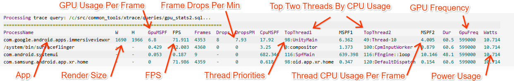
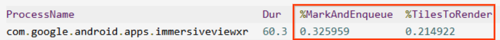
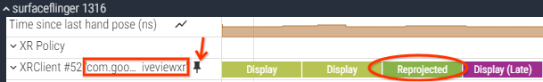
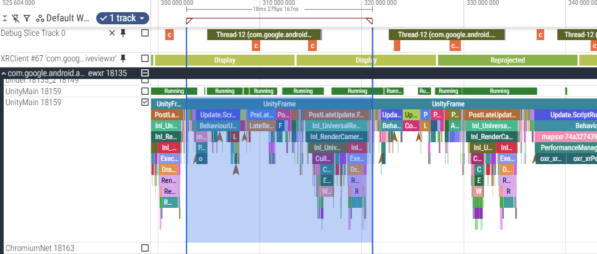

# **xtrace**

`xtrace` is a Perfetto tracing tool for performance analysis of Android XR applications.

## Key Features

* **Frame Stats:** Outputs stats to answer common performance questions immediately:

  

* **XR Defaults:** Captures key performance data from ftrace, Atrace, and Perfetto:

  * CPU and GPU scheduling data, frequencies and thermals
  * Atrace and Perfetto track events
  * Power usage
  * Logcat

* **GPU Tracing:** GPU usage timeline and counters.

  * Simple GPU events (\--gpu1):

    

  * Detailed GPU events (\--gpu2):

    

* **Testing Utilities:** Builtin features for consistent testing and automation:

  * Screenshot capture
  * Screen timeout setting

* **Custom Stats:** Supports custom event averages for tuning hot spots.

  `xtrace -t 60s --avg %MarkAndEnqueue --avg %TilesToRender`

  

* **Portable & Self-Contained:** Runs on Windows (Git Bash/Msys), Mac, and Linux.

## Common Usage

> **Note:** Generally aim for traces of 10 seconds or less (\< 100 MB) to avoid a sluggish Perfetto
> UI.

```shell
# See all available options and usage info
xtrace --help

# Begin a trace (Press Ctrl-C to stop)
xtrace

# Capture a 5-second trace with GPU events and frame stats
xtrace --gpu1 -t 5s

# Capture Atrace events from apps (ATRACE_TAG_APP).
# Ex: This shows all Unity events in Unity Profiler builds.
xtrace --atrace-apps "*"

# Capture a 3-second trace with detailed GPU events and counters
xtrace --gpu2 --counters -t 3s

# Capture a trace and grab a screenshot at the end
xtrace -t 5s --screenshot

# Open an existing trace file
xtrace -f my-trace.perfetto

# Show average durations of slices matching "*updateView"
xtrace -t 5s --avg "%updateView"

# Record a 1-minute trace with a 300MB trace buffer (default is 140MB)
xtrace -t 1m -b 300000
```

### Rooted Device Usage

```shell
# Capture a 3-second trace with basic GPU events
xtrace --gpu -t 3s

# Lock CPU, GPU and DDR frequencies during the 5-second trace.
xtrace -t 5s --lock-frequencies
```

## GPU Tracing

### GPU Events

There are two modes for GPU tracing with different detail levels and performance characteristics:

| Mode | Result | Est. GPU Overhead | Notes |
| :---- | :---- | :---- | :---- |
| --gpu1 | basic GPU events | < 1% | requires --enable-gpu |
| --gpu2 | GPU binning, tile renders, resolves | 10 - 20% | requires --enable-gpu |

### Detailed GPU Events

1. `xtrace --enable-gpu`

2. **Kill and restart the application**

3. `xtrace --gpu2`

## [Perfetto UI](https://ui.perfetto.dev) Tips

### Basic Interface

* WASD to zoom/pan.
* Mouse click/drag to select.
* M to mark the selection with vertical bars.
* ? for more help.

### Beware of Numerous Small Events

> ⚠️ **Note:**
> Watch out for cases of 10s or 100s of tiny events, each appearing to be only a few
> microseconds. The trace recording overhead makes those look more expensive than they
> are.

All trace events have some overhead while they are being recorded.
Perfetto events are around 1us, while Atrace events are 1-10us each.
Watch out for cases of 10s or 100s of back-to-back events, each appearing to be only a few
microseconds.

Android Unity Profiler builds have some events that occur 10s or 100s of times per frame, so
performance of those builds will be worse than normal when tracing with
`xtrace --atrace-apps "*"`.

### Finding Frame Drops

1. Open the **surfaceflinger process** section in the left column of processes.
2. Find the **XRClient row** matching your immersive application.
3. Click the pin button to pin that row to the top of the trace. The “Reprojected” frames are
frame drops, meaning that your app’s GPU rendering did not finish in time for the compositor to
pick up the frame.

   

4. Open the application process (usually at the top) and look at the events before the frame drop.
5. Check for GPU frame times that took too long (use \--gpu or \--gpu1 for that).
6. Check the main thread for too much CPU time spent during the past couple frames. In this case
the GPU frame times are okay around 11-12 ms, but the last few main thread updates took too long
at 18 ms, so that is the cause of the frame drop:

   

## Installation

Clone this repository.

Add the root repository directory to your PATH environment variable.

### Dependencies

* Android adb tool in PATH
* Bash terminal (ie: Git Bash in Windows)
* Python (for auto-loading in a browser)

## More Reading

* [Atrace](https://developer.android.com/topic/performance/tracing/custom-events-native): Android
Java/C++ event instrumentation.
* [Perfetto SDK](https://perfetto.dev/docs/instrumentation/track-events): Cross platform C++ event
instrumentation.
